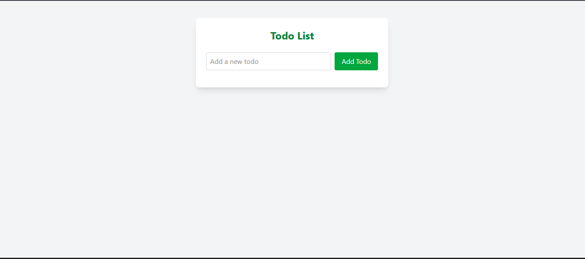

# 📝 React Todo App with Context & LocalStorage

A simple, modern, and responsive Todo List built with **React**, **Context API**, and **Tailwind CSS**.  
Your todos are saved in your browser, so you never lose track!

---

## 🚀 Features

- **Add, Edit, Delete Todos**  
- **Mark as Completed**  
- **Edit in-place**  
- **Persistent Storage** (localStorage)  
- **Context API** for global state  
- **Responsive & Beautiful UI** (Tailwind CSS)

---

## 📸 Preview



---

## 🛠️ Getting Started

1. **Clone the repo**
   ```bash
   git clone https://github.com/your-username/react-todo-context-local.git
   cd react-todo-context-local
   ```

2. **Install dependencies**
   ```bash
   npm install
   ```

3. **Start the app**
   ```bash
   npm run dev
   ```

4. **Open in browser**
   ```
   http://localhost:5173
   ```

---

## 🧩 Folder Structure

```
src/
  App.jsx
  App.css
  index.css
  main.jsx
  assets/
    react.svg
  components/
    TodoForm.jsx
    TodoItem.jsx
    index.js
  Contexts/
    TodoContext.js
    index.js
```

---

## ✨ Technologies Used

- [React](https://react.dev/)
- [Tailwind CSS](https://tailwindcss.com/)
- [Context API](https://react.dev/reference/react/useContext)
- [Vite](https://vitejs.dev/)

---

## 💡 Customization

- Change colors and styles in `App.jsx`, `TodoForm.jsx`, and `TodoItem.jsx` using Tailwind classes.
- Add more features like due dates, categories, or filters!

---

## 📄 License

MIT

---

